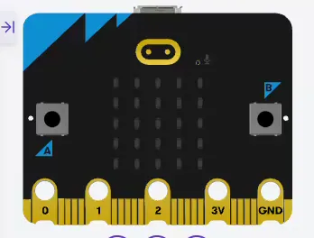

# StartSignal

A BBC micro:bit project — a reaction time measurement app inspired by the F1
start signal, five lights illuminate in sequence; when the lights out, it's 
the start signal.



## Prerequisites

* PC/Mac
* micro:bit
* USB cable to connect the micro:bit to your PC/Mac.

## Upload to micro:bit

1. Connect the micro:bit to your PC/Mac using a USB cable.
2. Copy and paste `startsignal.py` into the [micro:bit
   Python Editor](https://python.microbit.org/v/3).
3. Click the **"Send to micro:bit"** button.

## How to Play

1. Touch the **Logo pin** to start the game.
2. The LEDs will light up one by one from left to right. Once all five columns
   are lit, they will turn off.
3. Press **Button A** as soon as the lights go out.
4. Your reaction time will be displayed on the screen.
5. Touch the **Logo pin** again to restart the game.

## Development Environment

This program runs in MicroPython within the [micro:bit Python 
Editor](https://python.microbit.org/v/3). (Not tested in Python within the [MakeCode
editor](https://makecode.microbit.org/#editor))

## Setting up a Python Development Environment

### Create and activate virtual environment(venv)
```bash
# create virtual environment
$ python -m venv .venv
# activate for Windows
$ .venv/bin/activate 
# activate for macOS / Linux
$ source .venv/bin/activate
```

### To Upgrade pip [if necessary]
```bash
$ pip install --upgrade pip
```

### Installing development dependency packages
```bash
$ pip install -r requirements-dev.txt
```

### Format source files
```bash
$ black [FILES]...
```

### Linting source files
```bash
$ ruff check [FILES]...
```

### Check static type on source files
```bash
$ mypy [FILES]...
```

## References
* https://github.com/youpong/StartSignaljs ported to JavaScript(TypeScript).
* https://github.com/youpong/StartSignal-Duel for two players.

## License

MIT
